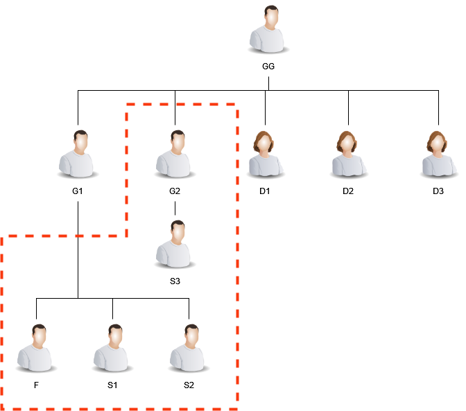

# Chapter 2 - The Property

In our previous chapter,  I introduced you to the case centered around the will that substantiates my father's ownership of the property. In this installment, I aim to shift the spotlight onto the property itself—its history, evolution, and the myriad events that have unfolded on the property having legal significance.

## Family Hierarchy

The family structure pertinent to this case, spans across generations, is as follows:
Great-grandfather **GG**, had two sons, **G1** and **G2**, along with three daughters, **D1**, **D2**, and **D3**. Moving a generation down, **G1** had three sons my father **F**, other (**S1**, **S2**) and three daughters (**B1**, **B2**, and **B3**), while **G2** had one son, **S3**.

As of the present day, the whereabouts of **D1**, **D2**, and **D3** is unknown. **GG**, **G1**, and **B1** have passed away. Among the living and actively involved in the ongoing legal battle are **G2**, **F**, **S1**, **S2**, **B2**, and **B3**. 

## Background Story
**GG** acquired a plot, will denote it as **P** now on, spanning **1350 square feet** in Kanpur. The acquisition was formalized through a lease deed dated **June 16, 1950**, between the Kanpur Development Board and **GG** for this property. Notably, this lease deed was duly registered at the Sub-Registrar's office in Kanpur on **June 29, 1950**. To provide some context, at the time of this purchase, **GG** resided with his family in a rented house, denoted as **R**. Unfortunately, **GG** passed away on **June 21, 1958**.

At the time of **GG's** passing, **S1**, **S2**, **S3**, and **B3** had not yet been born. 
Also, as mentioned in the last chapter, there exists a Will, dated **June 15, 1958**, (6 days before **GG** demise) from **GG**. The content of **the Will** clearly states that:
1. **D1**, **D2**, and **D3** were already married and residing in their respective in-laws' homes.
2. **G1** is able son, but **G2** is not mentaly developed to fulfil social responsibilities.
3. **F** will be the rightful owner of the plot after **GG** demise.

**GG** acquired the plot, designated as **P**, at a cost of Rs. 1425. For the initial payment, he made a downpayment of Rs 366 and 4 annas, with the understanding that the remaining sum would be settled through 12 six-monthly equated installments of Rs 107 and 6 annas each (clause present in the lease deed). **GG** dutifully paid several installments as agreed upon. However, following his demise, notifications for the outstanding installments began arriving at the residence **R**. To honor the commitment made by his great-grandfather, my father stepped in and, using his hard-earned money, settled the remaining installments on **May 8, 1970** (receipts of which are available), with the Kanpur Nagar Nigam. This act fulfilled the financial obligations tied to the property.

In **1979**, my father **F** took a significant step towards establishing a more permanent residence on **P** by constructing a roof of tile pantile, marking the initiation of our long-term habitation at the property. This marked the beginning of a more settled living arrangement. Fast forward to **1987**, fueled by a desire to enhance our quality of life, **F** further invested in the property. Using his hard-earned income, he constructed a durable pucca house on **P**, featuring one room, one kitchen, one bathroom, and even installed a hand-pump for convenience. The entire construction project was financed solely from his personal earnings, underlining his commitment to providing a comfortable and self-sufficient living space for our family. Additionally, **F** diligently fulfilled all civic responsibilities associated with **P**, ensuring the timely payment of house taxes, water taxes, and electricity bills, showcasing a responsible and proactive approach to property ownership (receipts of the same are available for consideration).

**G2** never resided at **P** at any point in his life uptil now. In the beginning, **F** served as the primary provider for the family, managing the property and ensuring the well-being of the household, which included **G1**, **S1**, and **S2**. **G1** expired in the year 1982. After a few years, **S1** and **S2** secured employment and became financially capable of supporting their family. However, they never contributed financially towards the care and maintenance of property **P**, including tax payments. In approximately **1985**, **S1** relocated, and around **1990**, **S2** also moved out of **P**. At that time, my father **F** provided a lump-sum amount to support their relocation, and an informal understanding was reached verbally. The understanding included an agreement that neither **S1** nor **S2** would assert any ownership claim over **P** thereafter. It's important to note that this agreement was based on a verbal commitment between the brothers, and there is no documentary evidence of this transaction.

Fast forward to **August 23, 2017**, when my father went to settle the dues with the Kanpur Nagar Nigam, he was met with an unexpected revelation. It was conveyed to him that the property had undergone mutation in his name, alongside five others, a process supposedly executed on **April 21, 2017**. This list included **G2**, **S1**, **S2**, **B1**, and **B2**. What added to the shock was that this mutation had occurred without any prior knowledge or consent from my father. In response to this surprising revelation, my father took it upon himself to scrutinize the documentation that served as the basis for the property mutation. His investigation revealed a significant flaw—the information on which the mutation had been executed was incorrect, failing to accurately represent the correct family hierarchy. Furthermore, for legal thoroughness, the mutation was officially announced in the less widely circulated local newspaper, **Sahara India**, on **18th March 2017**. My father, **F**, challenged the Nagar Nigam regarding the mutation, and we received a written response stating that "the mutation in the records of Nagar Nigam is solely for the purpose of tax payments and is unrelated to the ownership of the property.

On **April 10, 2018**, a distressing incident transpired. **G2**, accompanied by **S1**, **S2**, **S3**, and several others, forcibly entered property **P**, looted belongings from the house, and tried to take control of the premises. The details of this burglary and the legal aspects of the crime will be explored in the next blog post of this series. However, during our investigation into this event, a startling revelation emerged — allegedly, **G2** had sold **50%** of property **P**, while both **S1** and **S2** purportedly sold **16.67%** each through the registration of two separate sale deeds, based on the mutation recorded in the records of Kanpur Nagar Nigam a year prior. This robbery was an endeavor to seize possession of the property.

Upon deeper inquiry, we found that the transaction outlined in the sale deed for these partitions sold, never actually took place between the involved parties.

As mentioned in the last chapter, **F** already filed a **"Original Suit"** to assert his ownership rights for property **P** in the court of the Civil Judge, Kanpur Nagar, on **April 9, 2018**. The suit was filed to establish the rightful ownership of the property and to seek a permanent injunction against the defendants from interfering with the peaceful possession of the property. 
A flurry of paperwork has transpired between the involved parties, and the legal proceedings have been transferred among different jurisdictions. 

## Analysis
Let's delve into the key points and facts of the case evidence for which is available:
- There exists a Lease Deed of the Property **P** from **16th June 1950**, stipulating a lease term of **999 years**.
- The property **P** is not free-hold yet.
- The property **P** is an ancestral property.
- The property **P** is not mutated yet in the records of Kanpur Development Authority and still the name on record for the property is **GG**.
- There exists an **original Will**, dated **15th June 1958**.
- **GG** (owner of **P**) expired on **21st June 1958**.
- At the time of **GG's** passing, **S1**, **S2**, **S3**, and **B3** had not yet been born.
- Pending installments of **P** were paid by **F** on **8th May 1970**.
- All the taxes and bills of **P** were paid by **F** till-date.
- **G1** expired in th year **1982**.
- Mutation of the property **P** was done on **21st April 2017** in the records of Kanpur Nagar Nigam.
- The mutation in the records of Nagar Nigam is solely for the purpose of tax payments and is unrelated to the ownership of the property.
- **G2** sold **50%**, while both **S1** and **S2** purportedly sold **16.67%** each of the property **P** on **9th April 2018**.
- There is no notification to Kanpur Development Authority about the sale of the partitions of the property **P**.
- Transactions outlined in both of the sale deed for these partitions sold, never actually took place between the involved parties.
- **G2**, accompanied by **S1**, **S2**, **S3**, tried to take control of the premises of **P**.

The sale of portions of property **P** by **G2**, **S1**, and **S2** on **April 9, 2018**, constitutes a violation of several legal provisions and established principles governing the disposition of property. Here's a comprehensive overview of the relevant acts and laws:

#### 1. Lease Deed Violation:

- Quoting from the lease deed **Clause 2(n)**:
> That the lessee will in no cause assign, rellinquish, mortgage, sublet, transfer or part with the possession of any portion less that the whole of the demised premises nor cause any sub-division thereof by metes and bounds or otherwise: and will not, without the previous consent in writing of the Board, transfer, sublet, relinquish, mortgage or assign his interests in the demised premises or the buildings standing thereon or both as a whole: and every such trtansfer, assignment, relinquishment mortgage or sub-letting of the whole of the demised premises, or buildings or both shall be subject to, and the transferees, assignees or sub-leeses shall be bound by all the covenants and conditions herein contained and be answerable to the Board in all respects therefor.

The above quaoted text explicitly prohibits the lessee from transferring, assigning, or parting with possession of any portion of the demised premises without the prior written consent of the Board. By selling portions of the property, **G2**, **S1**, and **S2** have directly violated this clause.

#### 2. Section 6 of Hindu Succession Act, 1956  

This section states that no coparcener can alienate their undivided interest in coparcenary property without the consent of the other coparceners.

Property **P** is an ancestral property, and its inheritance and disposition are governed by the Hindu Succession Act, 1956.  Since the property is not yet freehold, it remains ancestral property, and the purported sale of portions by **G2**, **S1**, and **S2** without the consent of **F** is a clear violation of this section.

**Reference Cases and Verdict**:
1. **Rameshwar Dayal v. Janki Prasad (1932) 56 IA 263:**
In this landmark case, the Supreme Court of India held that a sale of ancestral property by a coparcener without the consent of other coparceners is voidable at the instance of the other coparceners. This implies that the sale can be challenged and overturned by the non-consenting legal heirs.

2. **Harbans Singh v. Harnek Singh (1968) AIR 1968 P&H 514**
The High Court of Punjab and Haryana upheld the principle established in Rameshwar Dayal, reiterating that a sale of ancestral property without the consent of other coparceners is void ab initio. This means that the sale is completely invalid from the outset and has no legal effect.

#### 3. Section 4 of Transfer of Property Act, 1882 

This section prohibits the transfer of property to which the transferor has no valid title or right to transfer. 

In this case, **G2**, **S1**, and **S2** could not transfer portions of the property without the consent of other legal heirs, as they did not have the sole authority to dispose of the entire property. Therefore, the purported sales are void under **Section 4** of the Act.

#### 4. Section 10 of The Indian Contract Act, 1872

This sections states that all agreements are void if they are made with the intention of committing a fraud. 

In this case, the sale deeds would be fraudulent because they represent transactions that never actually took place.

#### 5. The Registration Act, 1908 

This section states that a registered document is not valid if it is based on a document that is void under the law. 

In this case, the sale deeds would be void because they are based on transactions that never actually took place.

## Conclusion
The purported sale of portions of property **P** by **G2**, **S1**, and **S2** on **April 9, 2018**, raises substantial legal concerns. These transactions directly contravene the stipulations outlined in the Lease Deed dated June 16, 1950, violating the explicit prohibition against transferring, assigning, or parting with possession without the prior written consent of the Board. Moreover, the actions of **G2**, **S1**, and **S2** run afoul of the **Hindu Succession Act, 1956**, particularly **Section 6**, which governs the alienation of undivided interests in ancestral property without the unanimous consent of the coparceners. The purported sales also clash with the **Transfer of Property Act, 1882**, and **The Indian Contract Act, 1872**, as they involve transactions based on fraudulent agreements and a lack of valid title or right to transfer.

In the labyrinthine corridors of the Indian legal system, the prolonged battles for justice can exact a heavy toll on one's mental peace and stability. It often feels as though the system takes more than it gives, leaving individuals in a state of seemingly endless waiting. Instead of being productive and contributing to our own well-being, our families, and society at large, we often find ourselves entrapped in a ceaseless legal struggle.
However, I've chosen to view this extended ordeal as an opportunity, a chance to understand the law, put it through my unique perspective and present it to the world through this blog post. 

While I am by no means an expert, I am a novice who has embarked on a journey of research and the sharing of personal opinions. Through this blog post, I hope to engage in a constructive and open-minded dialogue with the wider community. I understand that this conversation may yield benefits not just for me but also for many others who find themselves in similar positions. Your thoughts, opinions, suggestions, and advice on this article are invaluable. 

Together, as an open-minded community, we can collectively work towards building a better India—a place where the pursuit of justice is not a cumbersome burden but a fundamental right accessible to all. Let's join hands and contribute to the ongoing transformation of our legal system and our society. Together, we can build a brighter and more just India.

